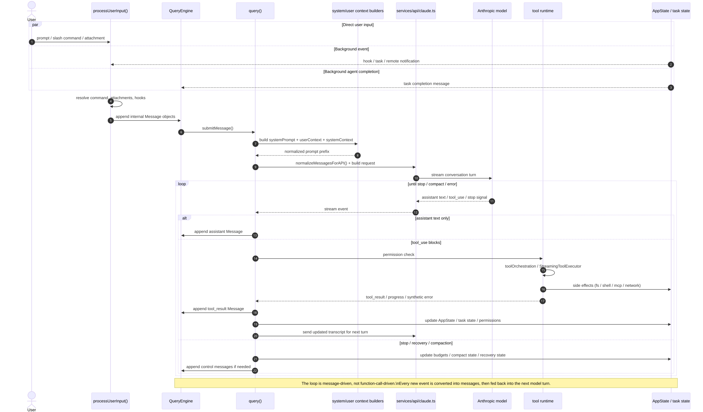

# Claude Code 的 Agent Loop 是怎么实现的



## 1. 入口不是模型，而是输入处理器

Claude Code 的第一步不是调用模型，而是把“用户输入”加工成系统可理解的内部消息。

入口在 [`processUserInput()`](src/utils/processUserInput/processUserInput.ts#L85)：

- 它接收字符串输入、附件、图片、IDE 选择、粘贴内容等
- 它会识别 slash command
- 它会执行 `UserPromptSubmit` hooks
- 它会决定当前输入是否真正继续进入 query loop

这里最重要的设计点是：**输入事件不是直接交给模型，而是先转成内部消息序列**。  
例如，hook 阻断时，系统甚至不会进入下一轮模型请求，而是直接返回一个 system message 作为结果。这个阻断逻辑在 [`processUserInput.ts`](src/utils/processUserInput/processUserInput.ts#L178) 一带能看得很清楚。

这意味着 Claude Code 的“用户输入层”本身就是一个消息工厂，而不是一个单纯的文本入口。

## 2. 会话状态由 QueryEngine 持有

真正的会话级状态不在 `query()` 里，而在 [`QueryEngine`](src/QueryEngine.ts#L209)。

`QueryEngine` 负责维护整段会话的长生命周期状态，包括：

- `mutableMessages`：当前会话消息序列
- `readFileState`：文件读取缓存
- `permissionDenials`：权限拒绝记录
- `totalUsage`：累计 token / cost
- `discoveredSkillNames`：本轮发现过的技能
- `loadedNestedMemoryPaths`：已注入的 memory 路径

这意味着 Claude Code 不是“每轮从零开始”的系统。它更像一个长期运行的 conversation runtime：每次 `submitMessage()` 只是向同一个会话状态机里塞入新的输入，然后启动一次新的 turn。

`submitMessage()` 里有两个很关键的动作：

1. 它包装 `canUseTool`，把权限拒绝记录下来，供 SDK/外层系统使用。
2. 它把当前运行环境、模型、thinking 配置、MCP、agents、AppState 都塞进一个 `ToolUseContext`。

你可以把 [`QueryEngine.ts`](src/QueryEngine.ts#L243) 理解成“会话控制器”，它负责把一次用户请求变成一次完整的 agent turn。

## 3. 模型看到的不是原始消息，而是被重建过的上下文

Claude Code 在调用模型之前，会先构造三层上下文：

- `systemPrompt`
- `userContext`
- `systemContext`

这一步在 [`fetchSystemPromptParts()`](src/utils/queryContext.ts#L44) 完成。

其中：

- `systemPrompt` 来自产品级提示词、工具说明、agent prompt、以及可能的 override
- `userContext` 里放 CLAUDE.md、当前日期等用户相关信息
- `systemContext` 里放 git 状态、branch、recent commits、cache breaker 等环境信息

然后再经过 [`buildEffectiveSystemPrompt()`](src/utils/systemPrompt.ts#L41) 做最终合成。这个函数决定了提示词优先级：

1. override prompt 直接覆盖
2. coordinator 模式用 coordinator prompt
3. main-thread agent prompt 覆盖或追加默认 prompt
4. custom prompt 替换默认 prompt
5. append prompt 统一追加在最后

这一步很关键，因为 Claude Code 的 agent loop 从一开始就不是“纯聊天上下文”，而是带有大量运行环境注入的“任务上下文”。

## 4. 送给模型之前，消息会被规范化

真正进入模型请求前，Claude Code 会把内部消息做一次大规模清洗和重写。

[`query()`](src/query.ts#L219) 中最重要的工作之一就是：

- 裁剪历史
- 处理 compact / context collapse
- 检查 token budget
- 注入 attachment / memory message
- 保证 tool_result 和 tool_use 的配对关系
- 用 `normalizeMessagesForAPI()` 把内部消息转成 API 可接受的格式

在 [`services/api/claude.ts`](src/services/api/claude.ts#L1259) 里可以看到，消息会在真正发请求前先做 `normalizeMessagesForAPI(messages, filteredTools)`，然后再做模型相关的后处理。

这一步说明 Claude Code 的消息流不是“日志式 transcript”，而是“可重建的运行态输入”。  
同一段对话历史，经过不同模型、不同工具集、不同压缩状态后，最终送给模型的内容可能并不相同。

## 5. 模型输出分成三类：文本、工具调用、控制信号

Claude Code 的模型输出不是简单的“assistant 一段文本”。它至少分成三种语义：

- 普通文本块
- `tool_use` 块
- stop / error / recovery 类控制信号

这就是为什么 [`query.ts`](src/query.ts#L241) 里必须写成一个显式的 loop。它不是“发一次请求，等一次结果”，而是一个持续消费流式事件的状态机。

当模型只输出文本时，系统把它 append 成 assistant message。  
当模型输出 `tool_use` 时，系统会把这些 tool call 交给工具运行时。  
当模型触发 token 上限、fallback、compact 或其他恢复路径时，系统会走不同的控制分支，并可能把控制信息也转回消息序列。

## 6. 工具执行不是同步函数，而是一个子状态机

工具执行的核心在两个层次：

- [`runTools()`](src/services/tools/toolOrchestration.ts#L19) 负责批处理和并发策略
- [`StreamingToolExecutor`](src/services/tools/StreamingToolExecutor.ts#L40) 负责流式执行、队列、取消、progress、fallback

### 6.1 先判断哪些 tool 能并发

[`partitionToolCalls()`](src/services/tools/toolOrchestration.ts#L91) 会检查每个 `tool_use`：

- 先找到 tool definition
- 校验 input schema
- 调用 `tool.isConcurrencySafe()`
- 把连续的只读工具归成并发 batch

这说明 Claude Code 把 tool execution 视为一种资源调度问题，而不是“顺序执行一串函数”。

### 6.2 流式执行器会边跑边产出消息

[`StreamingToolExecutor`](src/services/tools/StreamingToolExecutor.ts#L40) 支持：

- tool queue
- `queued / executing / completed / yielded` 状态
- sibling abort
- streaming fallback discard
- synthetic error message
- progress message 的即时输出

它最重要的职责是把外部 side effect 转成新的内部消息。  
例如：

- 文件读写会变成 tool_result 或 progress
- shell 命令执行结果会变成 tool_result
- MCP 调用结果会变成 tool_result
- 出错时会生成 synthetic error message，避免 loop 断掉

也就是说，工具运行结束后，系统并不是“返回一个值”这么简单，而是**继续制造下一批消息**。

## 7. 权限系统决定 tool_use 能不能真正变成外部动作

Claude Code 的权限不是 UI 装饰，而是 loop 的核心控制面。

[`permissions.ts`](src/utils/permissions/permissions.ts#L122) 里把规则拆成三类：

- allow
- deny
- ask

`createPermissionRequestMessage()` 会根据不同原因生成不同的用户可见解释，比如：

- hook 阻断
- rule 命中
- sandbox 限制
- 当前 permission mode
- 多步骤命令拆分后的子操作

这意味着一条 `tool_use` 不是“直接执行”，而是先经过策略判定。  
如果是 `ask`，系统会把交互交给 UI；如果是 `deny`，则产生拒绝消息并返回给模型；如果是 `allow`，才进入真正的工具执行器。

从 agent 算法角度看，这一步非常重要：Claude Code 把“执行动作的合法性”显式建模了，而不是把风险控制藏在工具内部。

## 8. 一次模型 turn 的完整闭环

把上面所有东西放在一起，一次完整 turn 大致长这样：

1. 用户输入或系统事件进入 `processUserInput()`
2. 输入被转成内部消息
3. `QueryEngine.submitMessage()` 接管会话状态
4. `query()` 构造系统提示词、用户上下文、系统上下文
5. 消息被 `normalizeMessagesForAPI()` 后送进 API
6. 模型流式输出文本、tool_use 或控制信号
7. tool_use 进入权限判定
8. 允许后由 tool runtime 执行
9. 执行结果变成 `tool_result` / progress / synthetic error
10. 新消息追加回会话消息序列
11. 下一轮继续使用更新后的 transcript 和 state

这个闭环的本质是：**每一步外部作用都必须回写为消息**。  
Claude Code 并不直接把副作用结果“返回给用户就结束”，它会把副作用重新编码进消息图里，再继续喂回模型。

## 9. 为什么这个 loop 适合研究 agent

对做 LLM agent 研究的人来说，这个实现有几个很值得关注的点。

### 9.1 它是一个真正的消息图，而不是一条线性的对话链

用户输入、hooks、任务完成、远程事件、tool result 都能成为新的消息来源。  
这比“用户 prompt -> 模型 -> 工具 -> 模型”这种简单 ReAct 链条复杂得多，也更接近真实产品里的 agent runtime。

### 9.2 它把 message normalization 当成一等公民

模型看到的输入不是 transcript 原文，而是经过裁剪、压缩、补充上下文、工具 schema 过滤之后的“可计算输入”。

### 9.3 它把 tool execution 当成可并发、可取消、可恢复的调度问题

并发安全、流式执行、sibling abort、fallback discard 这些机制，说明 Claude Code 的 agent loop 不是单线程脚本，而是一个并发受控系统。

### 9.4 它把权限、任务、远程事件都编进了同一个闭环

这意味着任何研究 agent loop 的人，都不能只盯着模型 token。  
真实的 agent 行为取决于：

- 输入预处理
- 上下文构造
- 权限决策
- 工具调度
- 状态回写
- 异步事件注入

## 10. 如果把它写成伪代码，大概就是这样

```text
while session alive:
  event = receive(user_input | hook | task_notification | remote_event)
  messages += process(event)

  prompt = build(system_prompt, user_context, system_context, messages)
  api_stream = call_model(prompt)

  for delta in api_stream:
    if delta is text:
      messages += assistant_message(delta)
    if delta is tool_use:
      decision = check_permission(tool_use)
      if allow:
        result = execute_tool(tool_use)
        messages += tool_result(result)
      else:
        messages += permission_reject_message(decision)
    if delta is stop/recovery:
      update_state(delta)

  state = reconcile(messages, app_state, tasks, budget)
```

这个伪代码已经很接近 Claude Code 的真实实现了，只是省掉了大量工程细节，比如 compaction、fallback、SDK 兼容、MCP、skills、plugin、background tasks 等。

## 结语

如果你只想记住一件事，那就是：Claude Code 的 agent loop 不是“模型调用工具”，而是“消息生成系统驱动模型，模型再驱动消息生成系统”。

源码里最值得你继续深挖的地方有三个：

- [`processUserInput.ts`](src/utils/processUserInput/processUserInput.ts#L85)
- [`QueryEngine.ts`](src/QueryEngine.ts#L209)
- [`query.ts`](src/query.ts#L219)

如果你愿意，我下一步可以继续把这篇博客扩成两篇更偏研究风格的文章：

1. `Claude Code` 的消息状态机与恢复机制
2. `Claude Code` 的工具调度、权限与并发控制
